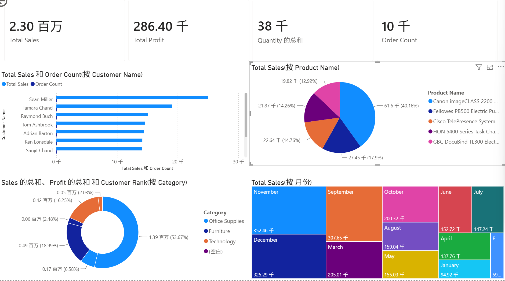

# 📊 SQL + Excel + Power BI Superstore Sales Analysis

## 📌 Project Summary

This is an end-to-end **data analytics portfolio project** based on a retail Superstore dataset.

It demonstrates a complete BI workflow:

> Data extraction → SQL modeling → Excel analysis → Power BI dashboard → Business insights

The goal is to analyze **sales performance, customer behavior, product profitability, and category trends** to support data-driven decision making.

---

## 🎯 Key Highlights

- 📦 Built relational data model using SQL (Customers / Orders / Products)
- 📊 Performed data analysis using SQL aggregation and validation
- 📈 Conducted Excel-based exploration (VLOOKUP, SUMIFS, Pivot Tables)
- 📊 Developed interactive Power BI dashboard
- 💡 Extracted actionable business insights

---

## 🧠 Business Insights (Summary)

- 📈 Sales peak in Q4, indicating strong seasonal demand
- 👥 Revenue follows Pareto principle (80% revenue from top customers)
- 💰 High sales ≠ high profit (margin imbalance exists)
- 📦 Office Supplies leads in revenue, but Furniture has lower profitability
- 🧩 Product sales are highly concentrated among top SKUs

---

## 📊 Dashboard Overview

The dashboard includes:

- KPI metrics (Sales / Profit / Quantity / Orders)
- Top 5 Customers analysis
- Top 5 Products performance
- Category breakdown
- Monthly sales trend analysis

---

## 🗂️ Project Structure

    SQL-Superstore-Analysis/

            ├── data/ 
                Raw dataset (Excel format)
            ├── database/ 
                SQLite database (superstore.db)
            ├── sql/ 
                SQL scripts for analysis
            ├── excel/ 
                Excel-based analysis and pivot tables
            ├── powerbi/ 
                Power BI dashboard files

---

---

## 🛠️ Tools & Technologies

- SQL (SQLite)
- Microsoft Excel (VLOOKUP, SUMIFS, Pivot Table)
- Power BI (DAX, Visualization)
- Data Analysis & Business Intelligence

---

## 🚀 Business Impact

This project demonstrates the ability to:

- Transform raw data into structured insights
- Identify revenue drivers and profitability issues
- Support business decisions with data visualization
- Build end-to-end analytics pipelines

---

## 📌 Author

Data Analytics Portfolio Project  
Focused on SQL + Excel + Power BI end-to-end analysis

